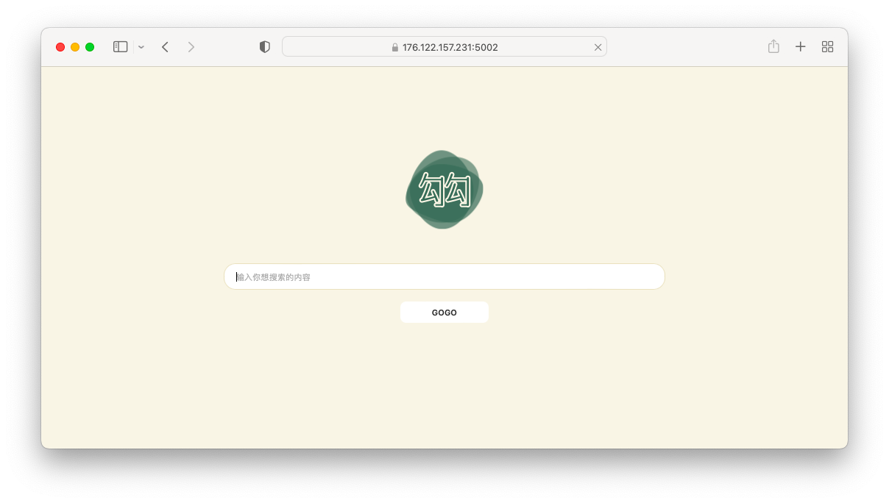
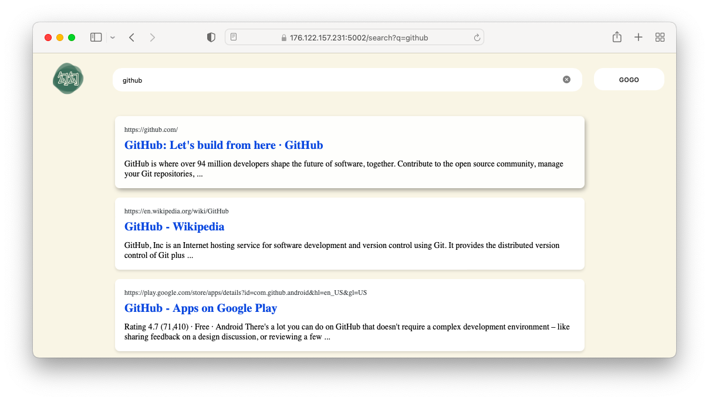
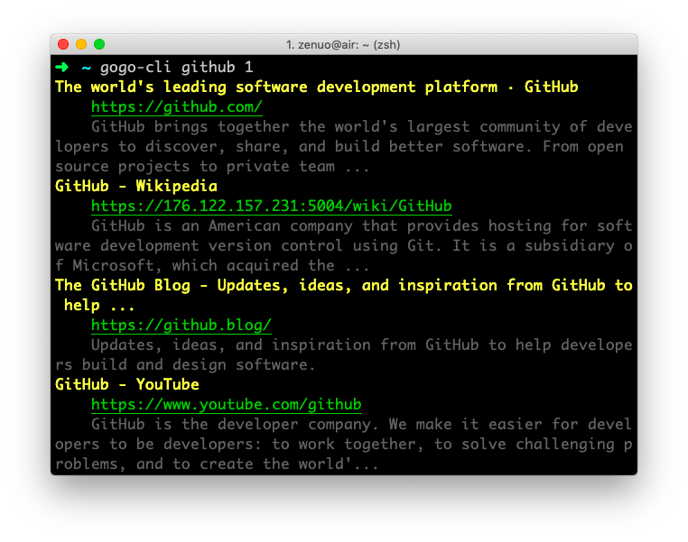

「勾勾」是一个搜索工具，搜索结果基于[谷歌搜索](https://google.com)，致力于「安全、简洁」的搜索体验。

### 实例列表

> 强烈感谢[webbillion](https://github.com/webbillion)同学的域名服务🤗🎉

- [gogo.webbillion.cn](https://gogo.webbillion.cn/)
- [176.122.157.231:5002](https://176.122.157.231:5002)

## 如何使用

> 本程序通过`网页`、`命令行`和`Web API`三种方式提供服务。

### 1 网页

首页截图：



搜索页面截图：



### 2 命令行

> 请到[Release](https://github.com/zenuo/gogo/releases)页面下载可执行程序，并重命名为`gogo-cli`，放置到`PATH`路径下

```bash
$ gogo-cli github 1
```

截图如下：



### 3 API

#### 搜索

```bash
$ curl -X GET -k "http://localhost:4998/api/search?q=github&p=1"
{
  "result": [
    {
      "name": "The world's leading software development platform · GitHub",
      "url": "https://github.com/",
      "desc": "GitHub brings together the world's largest community of developers to discover, share, and build better software. From open source projects to private team ..."
    }
  ],
  "error": null
}
```

#### 关键词提示

```bash
$ curl -X GET -k "http://localhost:4998/api/lint?q=github"
{
  "result": [
    "github",
    "github<b> desktop</b>",
    "github<b> stock</b>",
    "github<b> microsoft</b>",
    "github<b> pages</b>",
    "github<b> api</b>",
    "github<b> tutorial</b>",
    "github<b> login</b>",
    "github<b> markdown</b>",
    "github<b> gist</b>"
  ],
  "error": null
}
```

## 上手

### 1 Docker

```
# 拉取镜像
$ docker pull zenuo/gogo
# 创建容器
$ docker create -p 4999:4999 --name gogo zenuo/gogo
# 复制配置文件到容器（可选）
$ docker cp config.json gogo:/opt/gogo/application.json
# 运行镜像
$ docker start gogo
# 查看日志（可选）
$ docker logs -f gogo
```

### 2 从源代码构建

```
$ git clone https://github.com/zenuo/gogo.git
$ cd gogo/gogo-server
$ cargo build -rv
$ ./target/release/gogo-server config
```
