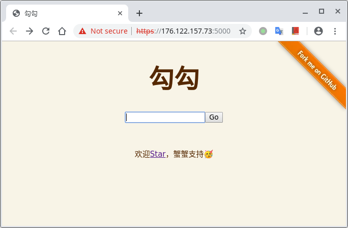
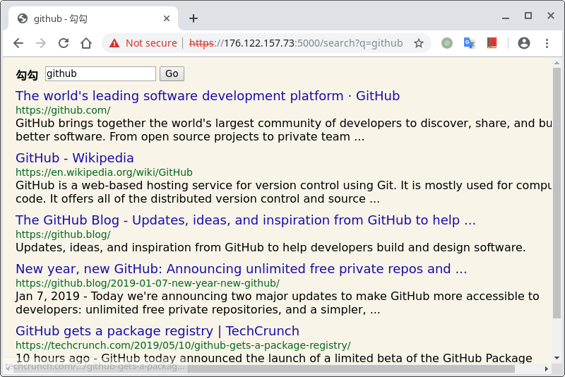
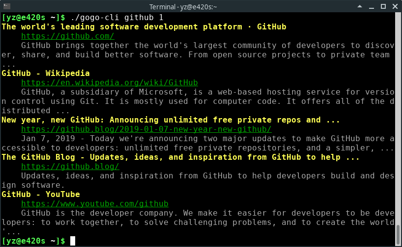

# 勾勾：一个基于谷歌的搜索工具

## 是什么

「勾勾」是一个搜索工具，搜索结果基于[谷歌搜索](https://google.com)和[Startpage](https://www.startpage.com/en/)，致力于「安全、简洁」的搜索体验。

### 安全

- 「勾勾」是一个在`用户`与`谷歌`之间的代理，谷歌无法得知用户的隐私（如UserAgent、Cookie等），也无法`跟踪用户的结果点击`
- 部署简单，基于`JDK 11`（提供有[Docker镜像](https://hub.docker.com/r/zenuo/gogo/)），仅需一台处于`可以访问谷歌的网络`的主机即可

### 简洁

- ~~精简~~（丑陋）到极致的Web前端
- 提供Web API，轻松地自定义搜索前端

## 如何使用

> 本程序通过`网页`、`命令行`和`Web API`三种方式提供服务。

### 1 网页

> 可访问[实例](https://176.122.157.231:5000)体验

首页截图：



搜索页面截图：



### 2 命令行

> 请到[Release](https://github.com/zenuo/gogo/releases)页面下载可执行程序，并重命名为`gogo-cli`，放置到`PATH`路径下

```bash
$ gogo-cli github 1
```

截图如下：



### 3 API

#### 搜索

```bash
$ curl -X GET -k "https://176.122.157.231:5000/api/search?q=github&p=1"
{
  "key": "github",
  "page": 1,
  "amount": 223000000,
  "elapsed": 0.43,
  "entries": [
    {
      "name": "The world's leading software development platform · GitHub",
      "url": "https://github.com/",
      "desc": "GitHub brings together the world's largest community of developers to discover, share, and build better software. From open source projects to private team ..."
    }
  ],
  "error": null
}
```

#### 关键词提示

```bash
$ curl -X GET -k "https://176.122.157.231:5000/api/lint?q=github"
{
  "key": "github",
  "lints": [
    "github",
    "github<b> desktop</b>",
    "github<b> stock</b>",
    "github<b> microsoft</b>",
    "github<b> pages</b>",
    "github<b> api</b>",
    "github<b> tutorial</b>",
    "github<b> login</b>",
    "github<b> markdown</b>",
    "github<b> gist</b>"
  ],
  "error": null
}
```

## 开发计划

- 后端实现细节文档

## 使用框架

> 站在巨人的肩膀上

- [Netty](https://netty.io/)
- [Ehcache](https://www.ehcache.org/)
- [Jsoup](https://jsoup.org/)
- [Spring Boot](https://github.com/spring-projects/spring-boot)

## 如何部署

### 1 Docker

> 感谢[liusen373](https://github.com/liusen373)同学的建议😉😉😉，我们创建了镜像仓库[zenuo/gogo](https://hub.docker.com/r/zenuo/gogo/tags)，本描述以Tag`1.7.0`为例，请以目前最新版本为准

```
# 拉取镜像
$ docker pull zenuo/gogo:1.7.0
# 创建容器
$ docker create -p 4999:4999 --name gogo zenuo/gogo:1.7.0
# 复制配置文件到容器（可选）
$ docker cp application.yml gogo:/opt/gogo/application.yml
# 运行镜像
$ docker start gogo
# 查看日志（可选）
$ docker logs -f gogo
```

### 2 构建

> 本描述以版本`1.7.0`为例，请以目前`master`分支版本为准

```
# 克隆工程到本地
$ git clone https://github.com/zenuo/gogo.git
# 切换到server文件夹
$ cd gogo/gogo-server
# 使用Maven构建，需要JDK 11
$ mvn -DskipTests=true package
# 拷贝Jar包到工作路径（假设为/opt/gogo）
$ sudo mkdir -p /opt/gogo && sudo chown -R $(whoami) /opt/gogo && cp target/gogo-1.7.0.jar /opt/gogo/gogo.jar
# 拷贝脚本（必须）和配置文件（可选）到工作路径
$ cp ./gogo.py /opt/gogo && cp ./application.yml /opt/gogo
# 切换到工作路径
$ cd /opt/gogo 
# 启动
$ python3 gogo.py start
# 重启（可选）
$ python3 gogo.py restart
# 停止（可选）
$ python3 gogo.py stop
```

## 实例集合

欢迎通过Issue分享实例供学习使用😌